# EDIN MLS 2026 Spring

Welcome to the Machine Learning Systems course at the University of Edinburgh (Spring 2026). This repository contains GPU programming tutorials and assignments designed to teach you how to write efficient GPU kernels for machine learning workloads.

## Quick Start

### Triton Track

```bash
# 1. Clone and enter the repository
git clone <repo-url> && cd edin-mls-26-spring

# 2. Set up the conda environment (Triton-only)
source utils/setup-triton.sh
# If `conda` isn't on PATH in a new shell:
# <conda> is your conda install prefix (e.g. ~/miniconda3 or /opt/conda).
# You can find it with: conda info --base
# source <conda>/bin/activate
# conda activate mls

# 3. Verify your environment
python triton-tutorial/0-environment/check.py

# 4. Start with Lesson 1
cd triton-tutorial/1-vectoradd && python vectoradd.py
```

### cuTile Track

```bash
# 1. Clone and enter the repository
git clone <repo-url> && cd edin-mls-26-spring

# 2. Set up the conda environment (cuTile + hw1)
source utils/setup-cutile.sh
# If `conda` isn't on PATH in a new shell:
# <conda> is your conda install prefix (e.g. ~/miniconda3 or /opt/conda).
# You can find it with: conda info --base
# source <conda>/bin/activate
# conda activate mls

# 3. Verify your environment
python cutile-tutorial/0-environment/check.py

# 4. Start with Lesson 1
cd cutile-tutorial/1-vectoradd && python vectoradd.py
```

## Repository Structure

```
edin-mls-26-spring/
├── triton-tutorial/          # OpenAI Triton tutorials (parallel to cuTile)
│   └── (same lesson structure as cutile-tutorial)
│
├── cutile-tutorial/          # NVIDIA cuTile GPU programming tutorials
│   ├── 0-environment/        # Environment verification
│   ├── 1-vectoradd/          # Lesson 1: Hello World - Vector Addition
│   ├── 2-execution-model/    # Lesson 2: Grid execution patterns (1D/2D)
│   ├── 3-data-model/         # Lesson 3: FP16/FP32 data types
│   ├── 4-transpose/          # Lesson 4: Matrix transpose optimization
│   ├── 5-secret-notes/       # Lesson 5: Advanced optimization notes
│   ├── 6-performance-tuning/ # Lesson 6: Autotuning and profiling
│   ├── 7-attention/          # Lesson 7: Attention mechanism kernels
│   └── *.pdf                 # Course slides
│
├── hw1-asr/                  # Homework 1: Automatic Speech Recognition
│   ├── glm_asr_triton_example/   # Triton baseline reference
│   ├── glm_asr_triton_template/  # YOUR WORK GOES HERE (Triton TODOs)
│   ├── glm_asr_cutile_example/   # cuTile baseline
│   ├── glm_asr_cutile_template/  # YOUR WORK GOES HERE (cuTile TODOs)
│   ├── glm_asr_scratch/          # PyTorch CPU reference
│   ├── benchmark.sh              # Performance benchmarking
│   ├── demo.py                   # Interactive Streamlit demo
│   └── test_audio.wav            # Test audio file
│
├── utils/                    # Environment tools
│   ├── setup-triton.sh       # Triton-only environment setup
│   └── setup-cutile.sh       # cuTile + hw1 environment setup
│
└── requirements-*.lock       # Platform-specific dependency snapshots
```

## Learning Path

Follow this recommended progression:

| Phase | What to Do | Goal |
|-------|------------|------|
| **1. Setup** | Run `source utils/setup-triton.sh` (or `source utils/setup-cutile.sh`) | Get your environment working |
| **2. Basics** | Complete Lessons 1-3 in `triton-tutorial/` | Understand GPU execution model |
| **3. Optimization** | Complete Lessons 4-6 | Learn memory patterns and autotuning |
| **4. Advanced** | Complete Lesson 7 (Attention) | Master complex kernel patterns |
| **5. Application** | Work on `hw1-asr/` | Apply skills to real ML task |

## Tutorial Frameworks

This course covers two GPU programming frameworks with identical lesson structures:

| Framework | Directory | Best For |
|-----------|-----------|----------|
| **Triton** | `triton-tutorial/` | Cross-platform, Python-native |
| **cuTile** | `cutile-tutorial/` | NVIDIA-specific optimization |

Start with **Triton** for broad GPU compatibility. Use **cuTile** if you want NVIDIA-specific optimization on supported GPUs.

## GPU Compatibility

This repository includes both cuTile and Triton tutorials, and their GPU support differs.

### Triton

Triton relies on the underlying PyTorch backend. A recent NVIDIA GPU (sm70+ recommended) is typically required for CUDA builds.

### cuTile

The cuTile tutorials are optimized for NVIDIA Blackwell GPUs. Other architectures are not supported in this repo.

| GPU Architecture | Support | Notes |
|------------------|---------|-------|
| Blackwell (sm_120) | Native | RTX PRO 6000, full cuTile support |
| Hopper (sm_90) | Not supported | H100 |
| Ada (sm_89) | Not supported | RTX 4090 |
| Ampere (sm_80) | Not supported | A100/RTX 30xx |

If you are on non-Blackwell GPUs, use Triton tutorials instead.

## Choosing the Right GPU Programming Tool

Before diving into the homework, it's worth understanding where the tools we teach fit in the broader GPU programming landscape.

```mermaid
flowchart TD
    Start(["🎯 GPU Programming<br/> Tool Selection"])
    Q1{"Access to Blackwell? [1]"}

    Start --> Q1

    Q1 -->|Yes| A{"Go deeper<br/>in GPU kernel?"}
    Q1 -->|No| B{"Focus on<br/>algorithm only?"}

    A -->|Yes| C{"Want to be a<br/>super geek on GPU?"}
    A -->|No| D["💎 Cutile [4]<br/>Hardware-Software<br/>Co-design"]

    C -->|Yes| E["🔥 CUDA [2]<br/>Maximum Control <br/>and Performance"]
    C -->|No| F["⚡ Triton<br/>Kernel Development"]

    B -->|Yes| G["🐍 CuPy<br/>NumPy-compatible <br/>GPU Arrays"]
    B -->|No| H["⚡ Triton [3]<br/>OpenAI's Compiler<br/>Framework"]

    style Start fill:#667eea,stroke:#5a67d8,color:#fff
    style E fill:#76b900,stroke:#5a9900,color:#fff
    style F fill:#f97316,stroke:#ea580c,color:#fff
    style D fill:#8b5cf6,stroke:#7c3aed,color:#fff
    style G fill:#06b6d4,stroke:#0891b2,color:#fff
    style H fill:#f97316,stroke:#ea580c,color:#fff
```



### Tool Comparison

| **Tool** | **Difficulty** | **Performance Control** | **Best For** |
|----------|----------------|-------------------------|--------------|
| **CUDA** | ⭐⭐⭐⭐⭐ | Ultimate | Deep optimization, Nvidia careers |
| **Triton** | ⭐⭐⭐ | High | Rapid prototyping, research |
| **Cutile** | ⭐⭐ | High | Hardware-software co-design |
| **CuPy** | ⭐ | Medium | NumPy users, quick migration |

### Notes & References

**[1] Blackwell GPU Access** — If you need access to Nvidia's Blackwell architecture, the most budget-friendly option is the RTX 5060 available through [vast.ai](http://vast.ai), priced at just $0.10 per hour. This makes it an accessible choice for students and researchers who want to experiment with Cutile without significant upfront costs.

**[2] CUDA Career Path** — Mastering CUDA is a strong pathway to a career at Nvidia. If you're interested in pursuing this route, this guide provides a detailed blueprint for landing an entry-level position: [How to Get Hired at Nvidia in 2026](https://example.com/nvidia-hiring-guide)

**[3] Triton at OpenAI** — OpenAI is actively hiring software engineers to work on the Triton compiler, which signals the growing importance of Triton in production ML infrastructure. If you're proficient in Triton, this could be a compelling career opportunity: [Software Engineer, Triton Compiler](https://openai.com/careers/software-engineer-triton-compiler-san-francisco/)

**[4] Why Cutile?** — Cutile offers a balanced approach for those interested in hardware-software co-design. It provides more control than high-level frameworks like CuPy, while being more approachable than writing raw CUDA kernels. This makes it ideal for developers who want to optimize performance without getting lost in low-level details.

---

## Homework 1: Automatic Speech Recognition

As we discussed in [Tool Comparison](https://github.com/ed-aisys/edin-mls-26-spring#tool-comparison), CUDA can be quite complex and daunting for beginners, while CuPy may experience significant performance issues. We aimed to strike a balance between ease of programming and performance. Therefore, we offer two frameworks for HW1: the Triton version and the cuTile version.

The `hw1-asr/` directory contains a hands-on assignment implementing GPU-accelerated speech recognition:

```
hw1-asr/
├── glm_asr_triton_example/   # Triton baseline reference
├── glm_asr_triton_template/  # Start here - fill in the TODOs (Triton)
├── glm_asr_cutile_example/   # cuTile baseline
├── glm_asr_cutile_template/  # Start here - fill in the TODOs (cuTile)
└── glm_asr_scratch/          # PyTorch CPU version for understanding
```

**Key files in each implementation:**
- `layers.py` - Linear, LayerNorm, MLP, Embedding layers
- `attention.py` - Multi-head attention mechanism
- `rope.py` - Rotary Position Embedding
- `model.py` - Full ASR model architecture

See [`hw1-asr/README.md`](hw1-asr/README.md) for detailed assignment instructions.

## Requirements Lock Files

The `requirements-*.lock` files are platform-specific dependency snapshots:

- `requirements-blackwell.lock` - NVIDIA Blackwell GPU (RTX PRO 6000, sm_120)
- `requirements-hopper.lock` - NVIDIA Hopper GPU (if available)

These are generated by `conda list --export` and vary across GPU architectures. Use `source utils/setup-triton.sh` (or `source utils/setup-cutile.sh`) for automatic configuration.

## Resources

- **Course Slides**: `cutile-tutorial/Modern GPU Programming 2026-0123.pdf`
- **Using the teaching cluster**: **Read `Teaching Cluster.pdf` first** (the tutorial includes diagrams and figures; `Teaching Cluster.md` is a convenience copy)
- **Each lesson has its own README** with detailed explanations
- **Benchmark your progress**: `cd hw1-asr && bash benchmark.sh`

## Troubleshooting

| Issue | Solution |
|-------|----------|
| Environment setup fails | Check conda ToS accepted: `conda tos accept` |
| cuTile import errors | cuTile is only supported on Blackwell GPUs in this repo |
| CUDA out of memory | Reduce batch size or restart Python kernel |
| Kernel compilation slow | First run compiles; subsequent runs are cached |

## License

Apache 2.0 - See [LICENSE](LICENSE) for details.
